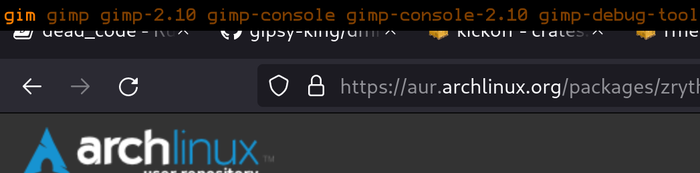

# dmitri

**Fast and minimal application launcher, like dmenu**

Disclaimer: not as slim as dmenu.

##

 * Renders truetype fonts
 * Fuzzy matching beyond substrings

## Options and defaults

`-f <fontname> (monospace, ProFontWindows)`
 select a system font.

`-s <fontsize> (32)` set font size.

`-c <color> (#ff8800)` set color.

`-m <margin> (7)` set margin surrounding text.

`-p <precise-wheight> (5.0)` set additional wheight for items that match subtext. Example: `shoot` in `xfce4-screenshooter` gets pulled to the top of tab completion list.

## Keybindings

* `Tab` jumps to next completion
* `Shift+Tab` jumps to previous completion
* `Esc` aborts and closes dmitri
* `Enter` selects either input or tab selection and executes the application, and closes dmitri

